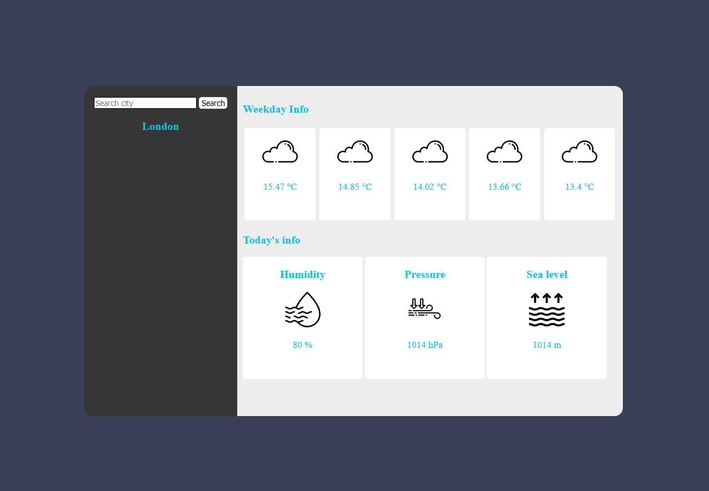

# Simple WeatherApp written in Flask and HTML/CSS 
I've decided to learn Flask framework so I wrote simple WeatherApp.
I've used Weather API from OpenWeatherMap https://openweathermap.org/api to get current weather data.
Icons are taken from Flaticon https://www.flaticon.com/.


## Installing
Run the following to install Flask module
```bash
pip install flask
```

## Before running
Before running you have to create your own OpenWeatherMap account on https://openweathermap.org/
and generate api key and then put your api key to the code


## Running the application 
Run the following to run the application 
```bash
python3 app.py
```
or 
```bash
python app.py
```